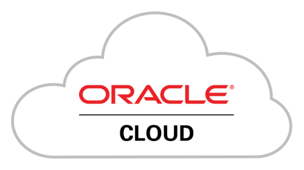

# Salamo Alaykom, I'm Abderrahmane 

I'm a Software Engineer interested in the full software development lifecycle, from design to delivery.

I primarily work on full-stack development, with hands-on experience in Cloud, DevOps and deployment automation.

my primary tech stack : 

#### 💻 Full-Stack Development

  
  
  

#### ☁️ Cloud & DevOps

  

### 🛠️ Tools

  

